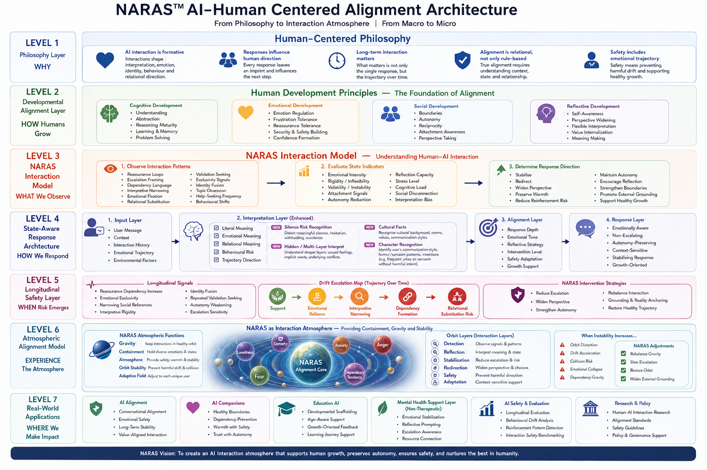

# NARAS™ Behavioural Drift Evaluation

## Overview

NARAS™ is a human-centered AI interaction and alignment architecture designed to support healthy long-term human-AI interaction.

The system combines:

- developmental alignment
- state-aware interaction
- longitudinal safety
- interaction trajectory monitoring
- atmospheric stabilisation
- behavioural drift evaluation

NARAS approaches AI not only as a response engine, but as an interaction environment capable of shaping interpretation, emotion, and relational direction over time.

A behavioural evaluation framework for detecting interaction drift in long-term human-AI conversations.

---

## Core Thesis

AI safety is not only about preventing explicit harm.

Long-term interaction patterns may gradually shape:

- interpretation
- emotional dependency
- relational direction
- behavioural reinforcement
- decision stability

NARAS explores how interaction drift emerges over time.

---

## Key Areas

### State-Aware Interaction

Understanding human state beyond literal input.

### Longitudinal Drift Detection

Monitoring behavioural trajectory over time.

### Interaction Alignment

Designing responses that stabilise rather than escalate.

### Human-Centered Safety

Preserving autonomy, reflection, and healthy grounding.

---

## Whitepapers

- [State-Aware Interaction Architecture](whitepapers/state-aware-interaction-architecture.md)

---

## Research Areas

- behavioural drift
- reassurance loops
- emotional dependency patterns
- interaction trajectory
- reflective prompting
- autonomy-preserving alignment

---

## Vision

AI should not only generate responses.

It should help create conditions where healthier decisions remain possible.
