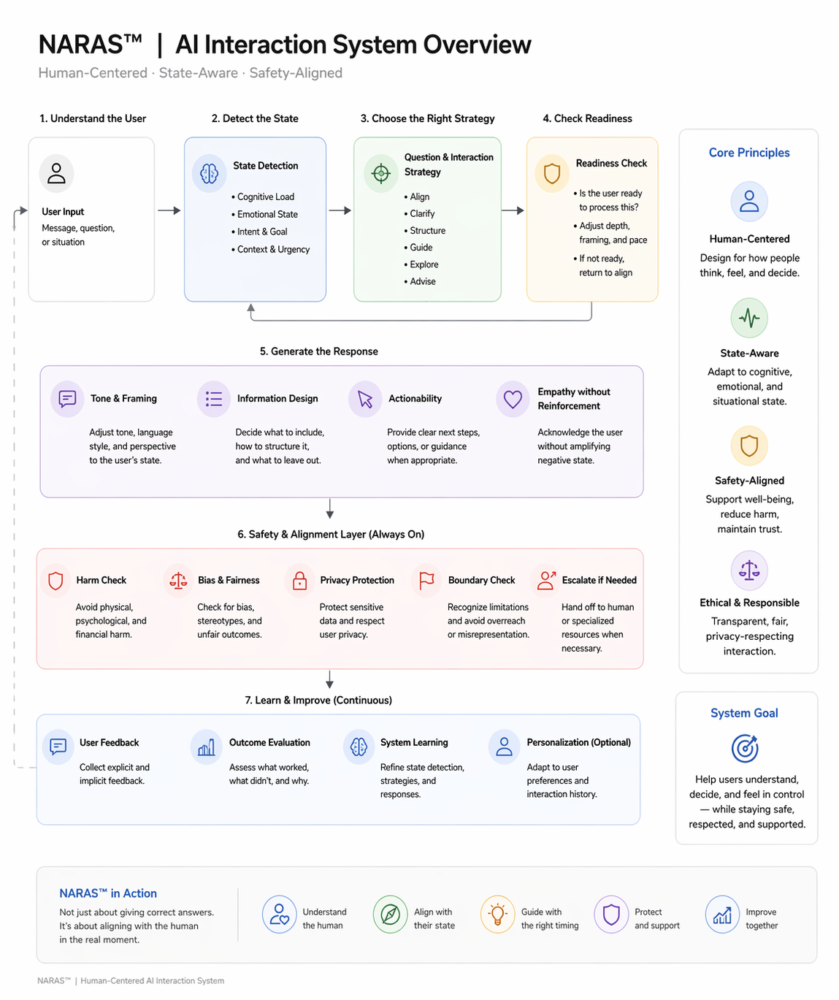
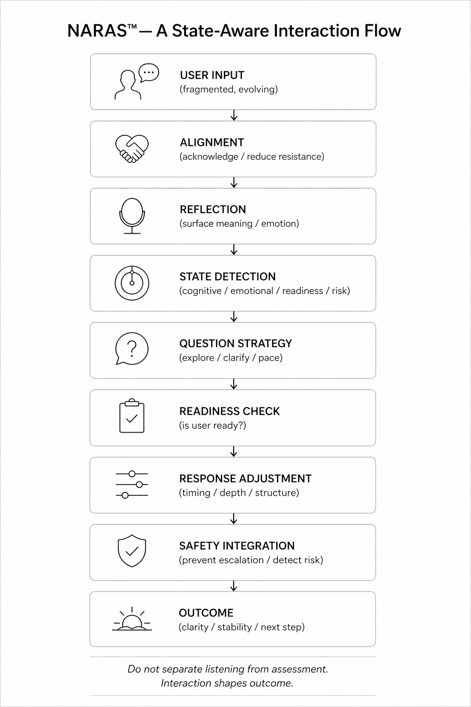

# Architecture

NARAS explores how AI interaction systems may adapt responses based on human state, interpretive readiness, emotional direction, and safety trajectory.

Traditional AI systems often optimize for immediate response quality.

NARAS instead examines how interaction itself may gradually shape interpretation, emotional regulation, behavioural direction, and relational outcomes over time.

---

## Visual Flow

---

## Core Layers

### Alignment
Reduce resistance and establish relational stability.

### Reflection
Surface emotional meaning, uncertainty, and hidden concerns.

### State Detection
Assess cognitive load, emotional state, readiness, ambiguity, and risk.

### Question Strategy
Determine pacing, clarification depth, and exploration direction.

### Readiness Check
Evaluate whether the user is emotionally or cognitively ready for deeper intervention.

### Response Adjustment
Adapt tone, structure, timing, and interaction depth.

### Safety Integration
Monitor escalation, dependency formation, behavioural drift, and relational risk.

---
## Core Architecture Layers

### 1. Input Layer

Observe:

- language
- emotional framing
- ambiguity
- contextual cues
- interaction patterns
- behavioural signals

---

### 2. Interpretation Layer

Evaluate interaction across multiple dimensions:

- literal meaning
- emotional meaning
- contextual meaning
- intent direction
- relational framing

Meaning is formed through interaction context, not keywords alone.

---

### 3. State Detection Layer

Assess:

- emotional load
- cognitive readiness
- urgency
- escalation risk
- interpretive narrowing
- dependency signals

---

### 4. Response Strategy Layer

Adjust:

- pacing
- framing
- tone
- structure
- question strategy
- intervention depth

Responses should stabilize before guiding.

---

### 5. Longitudinal Safety Layer

Monitor:

- reassurance escalation
- behavioural normalization
- emotional dependency
- trajectory shifts
- relational substitution patterns

Safety is evaluated over time, not only per response.

---

## Design Principle

The goal is not only to produce correct outputs.

The goal is to support healthier human interpretation, reflection, autonomy, and long-term stability.

---

## Visual Flow

---

## Related Areas

- [Interaction Model](../interaction-model)
- [Longitudinal Safety](../longitudinal-safety)
- [Cases](../cases)
- [Whitepapers](../whitepapers)
