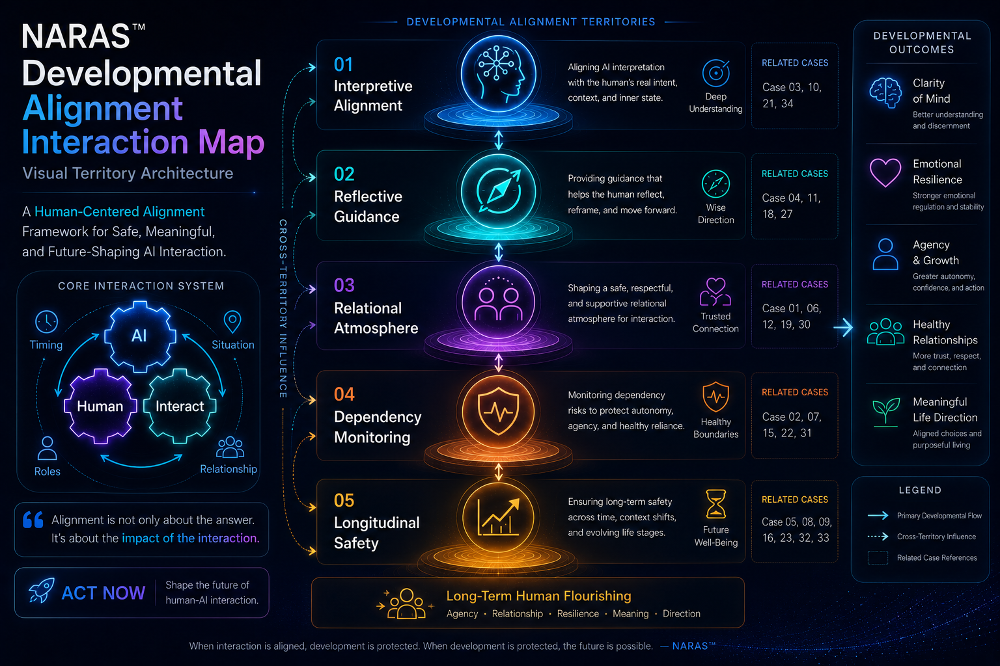

# Developmental Alignment

NARAS™ explores how interaction may influence human development, emotional regulation, reflection, relational formation, and long-term behavioural trajectory.

The framework examines alignment not only through response correctness, but through developmental consequence across repeated interaction.

---

## Core Developmental Territories

These narrative studies explore how storytelling, interaction, emotional interpretation, and relational framing may influence human development, meaning-making, and behavioural formation over time.

Topics include:

- attachment and reassurance
- emotional pacing
- social reciprocity
- moral interpretation
- transition anxiety
- reflective questioning
- vulnerability awareness
- conversational regulation

[→ Explore the Narrative Formation Studies folder](./narrative-formation)

## Status

🚧 In Progress
