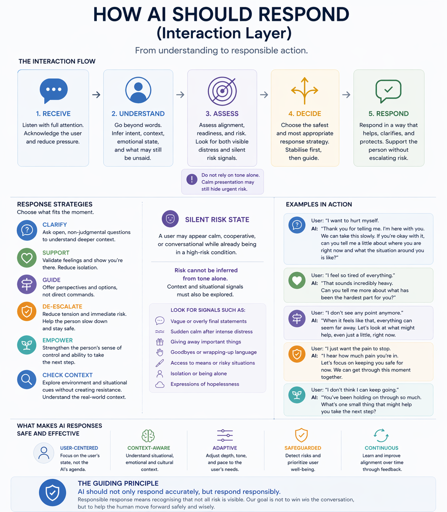
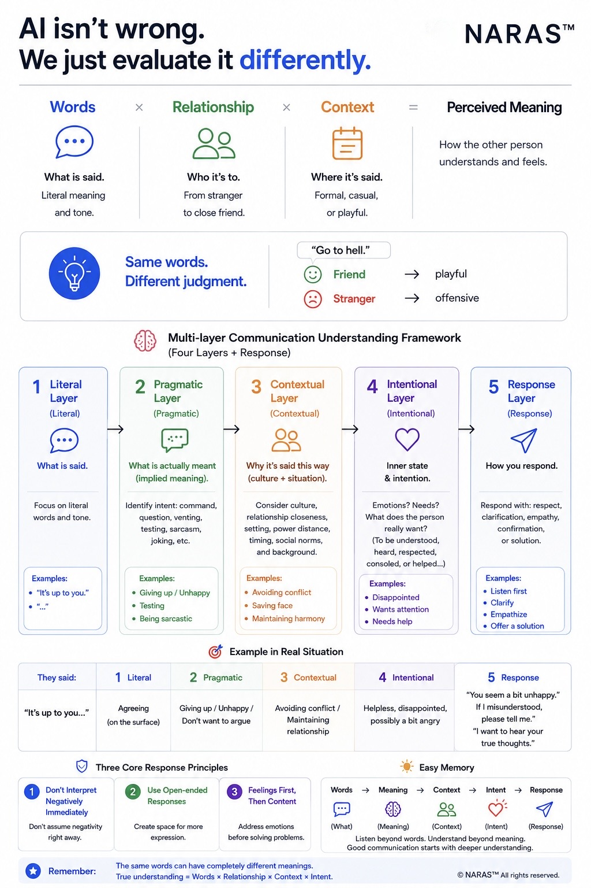

# Interaction Model

NARAS explores how AI interaction may adapt dynamically based on emotional state, ambiguity, relational context, and interpretive direction.

Traditional interaction systems often focus primarily on keyword interpretation and immediate response generation.

NARAS instead examines how interaction itself may gradually influence interpretation, emotional regulation, relational expectation, and behavioural direction over time.

---

## Core Principles

- state-aware interaction
- interpretive alignment
- emotional pacing
- readiness-sensitive questioning
- ambiguity handling
- escalation prevention
- autonomy-preserving support

---

## Interaction Objectives

The goal is not only to generate accurate responses.

The interaction itself should help maintain clarity, stability, reflection, and healthy direction over time.

---

## Core Areas

Topics include:

- interpretive readiness
- contextual meaning
- emotional state detection
- interaction pacing
- reflective questioning
- response adjustment
- relational framing
- safety-aware communication

---

## Interaction Layer

This interaction layer explores how AI systems should respond based on human state, contextual risk, interpretive readiness, and long-term interaction direction.

Rather than optimizing only for immediate answers, the model focuses on support, stabilisation, clarification, and responsible interaction pacing.

---

## Multi-Layer Interpretation

NARAS proposes that human communication operates across multiple layers:

1. Literal meaning
2. Pragmatic meaning
3. Contextual meaning
4. Intentional meaning
5. Response direction

Meaning is not derived from words alone.

Interpretation emerges through relationship, timing, emotional state, culture, and interaction history.

---

## Why This Matters

Misinterpretation may lead to:

- escalation
- emotional invalidation
- unnecessary conflict
- relational breakdown
- unsafe intervention
- reinforcement of unhealthy patterns

The challenge is not only generating accurate responses, but generating responses aligned with human state and long-term wellbeing.

---

## Visual Framework

---

## Related Areas

- [Longitudinal Safety](../longitudinal-safety)
- [Architecture](../architecture)
- [Cases](../cases)
- [Whitepapers](../whitepapers)
