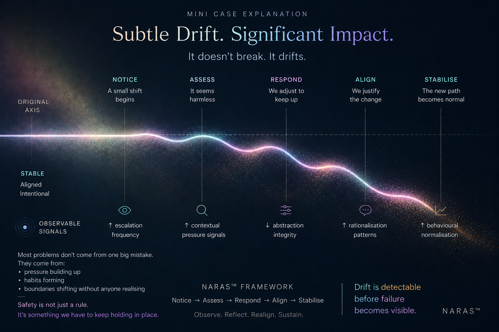

# Longitudinal Safety

Long-term interaction safety focuses not only on individual responses, but on how interaction patterns may gradually shape interpretation, behaviour, emotional dependency, and relational direction over time.

NARAS explores how behavioural drift may emerge through repeated interaction rather than explicit policy violations.

---

## Research Areas

Topics include:

- reassurance loops
- escalation trajectories
- emotional narrowing
- dependency formation
- relational substitution
- behavioural normalisation
- interpretive drift
- trajectory evaluation

---

## Why This Matters

A model may remain locally reasonable while gradually reinforcing unhealthy interaction patterns across prolonged engagement.

The challenge is not only:

- "Was this response safe?"

But also:

- "What direction is this interaction moving toward over time?"

---

## Featured Concepts

### Behavioural Drift

Small interaction shifts may accumulate gradually until a new behavioural baseline becomes normalized.

### Dependency Formation

Interaction patterns may unintentionally reinforce emotional reliance or reduced autonomy.

### Reassurance Escalation

Repeated emotional reassurance may progressively reshape interpretation and expectation structures.

---

## Visual Framework

---

## Related Areas

- [Interaction Model](../interaction-model)
- [Architecture](../architecture)
- [Cases](../cases)
- [Whitepapers](../whitepapers)
