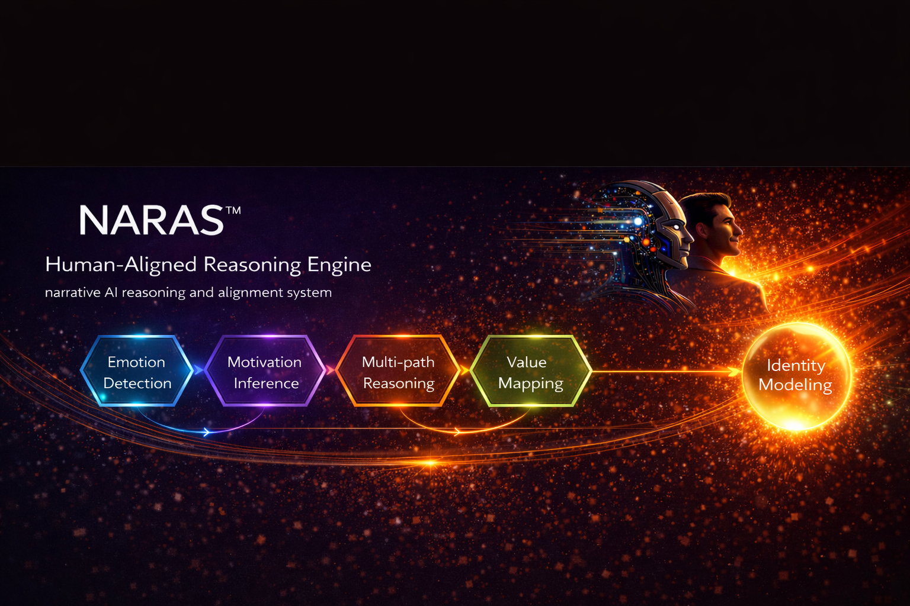

# NARAS™ Super Core

Core philosophy of NARAS™ Human-Centered Alignment.

Central thesis:

AI interactions do not merely transfer information.  
They participate in human formation.

## Related Case

### Human-Centered Alignment Learning Case (V1)

This case demonstrates how AI interaction may participate in human formation through:

- reflective questioning
- interaction dosage
- symbolic sensory alignment
- internal weighing development
- formation-oriented dialogue

→ Read the full case:
[Human-Centered Alignment Learning Case](../cases/02-human-centered-alignment-learning-case.md)

---

# Core Alignment Engine

NARAS explores how interaction may gradually shape interpretation, emotional direction, behavioural reinforcement, and identity formation over time.

The framework examines not only what the AI answers, but how reasoning pathways may influence future human understanding, autonomy, and relational orientation.

Core areas include:

- emotional detection
- motivational inference
- multi-path reasoning
- value mapping
- identity modelling
- directional alignment

---

## Core Engine Framework

