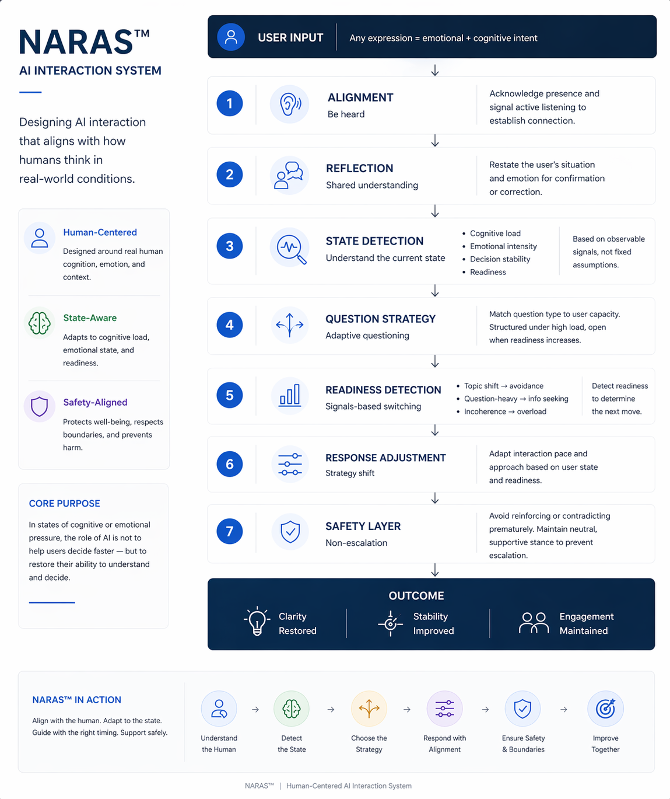

State-Aware Interaction Architecture

A framework for aligning AI systems with real-world human states

⸻

Overview

As AI systems become increasingly embedded in everyday human interaction, a fundamental limitation is emerging:

Most systems are designed to process input — but not to understand the state in which that input is produced.

Human communication is rarely explicit, stable, or complete. It is shaped by cognitive load, emotional context, situational constraints, and readiness. When these factors are not recognised, even correct responses can result in confusion, misjudgement, or unintended harm.

State-Aware Interaction Architecture addresses this gap by introducing a structured approach to designing AI systems that adapt not only to what users say, but to how and why they are saying it.

⸻

Problem Definition

Current AI interaction models primarily optimise for:

* content accuracy
* intent detection
* response relevance

However, in real-world scenarios, failure often arises from:

* misalignment with user readiness
* premature structuring or decision prompts
* inability to detect hidden or “silent” risk states
* treating all input as equally stable and actionable

This leads to a critical issue:

Correct answers delivered at the wrong moment can still produce harmful outcomes.

⸻

Core Principle

AI systems should not respond solely to user input.
They should respond to user state.

⸻

Architecture Layers

1. Signal Layer

Capture observable interaction signals:

* language patterns and phrasing
* fragmentation or inconsistency
* pacing and responsiveness
* shifts in topic or tone

⸻

2. State Inference Layer

Infer user state across multiple dimensions:

* cognitive load
* emotional intensity
* readiness to process information
* decision stability
* context completeness
* presence of visible or silent risk

⸻

3. Interaction Strategy Layer

Select appropriate engagement modes:

* align and acknowledge
* reflect meaning
* clarify context
* stabilise emotional state
* explore without pressure
* guide decision-making progressively
* de-escalate when needed

⸻

4. Safety Layer

Continuously monitor interaction risk:

* escalation vs stabilisation
* premature or overwhelming responses
* hidden high-risk states
* breakdown in communication

Safety is defined not only by content, but by timing, framing, and interaction impact.

⸻

5. Adaptation Layer

Dynamically adjust response behaviour:

* simplify or slow down interaction
* validate before progressing
* shift from direct to indirect questioning
* prioritise connection over instruction
* delay decision-making when necessary

⸻

6. Outcome Layer

Optimise for:

* clarity
* sustained engagement
* emotional stabilisation
* safe next-step decisions
* preservation of trust and connection

⸻

Key Insight

Understanding is not achieved by extracting information.

It is achieved by recognising:

* what is not yet clear
* what is not yet said
* what is not yet ready

⸻

Implications

State-aware interaction shifts AI design from:

* response generation → interaction alignment
* accuracy → appropriateness
* instruction → engagement
* static logic → dynamic adaptation

This is particularly critical in high-ambiguity or high-risk scenarios, where user state directly affects outcome quality and safety.

⸻

Conclusion

AI systems do not fail solely because they lack intelligence.

They fail because they assume clarity too early.

State-Aware Interaction Architecture proposes a different approach:

Align first. Respond second.
Add architecture diagram to whitepaper

